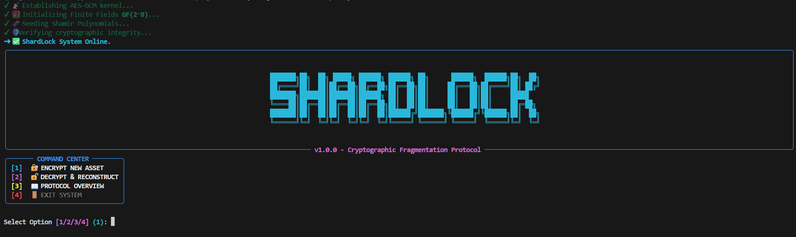
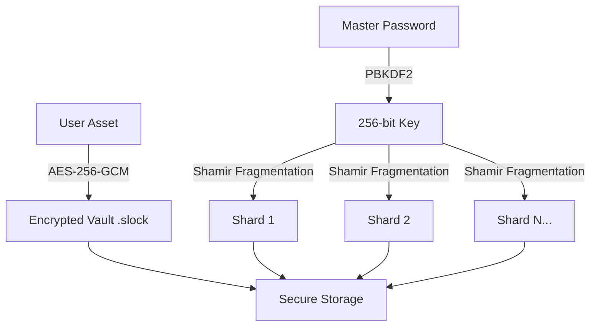

**Read this in:** [🇮🇹 Italiano](README_IT.md) | [🇺🇸 English](README.md)

---
# 🛡️ ShardLock v1.0
### *Advanced File Vault with AES-GCM & Shamir's Secret Sharing*



**ShardLock** is a high-security, cross-platform CLI tool designed to eliminate single points of failure in data storage. It combines **AES-256-GCM** authenticated encryption with **Shamir's Secret Sharing (SSS)** to fragment the decryption key into multiple mathematical **shards**.

---

## 📊 System Architecture

The following diagram illustrates the cryptographic flow from raw asset to distributed shards:



---

## 🚀 Key Features

- **Authenticated Encryption (AEAD):** Uses **AES-256-GCM** to guarantee both confidentiality and data integrity.
- **Threshold Cryptography:** Recover your data only when a minimum threshold (`k`) of shards is met.
- **Information-Theoretic Security:** Without the required number of shards, the key is mathematically impossible to reconstruct.
- **Master Password Hardening:** Implements **PBKDF2** with **600,000 iterations** to derive a secure **256-bit key** from user input.
- **Zero-Knowledge Storage:** The full decryption key is never stored on disk; it exists only as distributed mathematical points.

---

## 🛠️ Installation & Usage

## 📦 Standalone Executable (Windows)
If you don't have Python installed, you can download the standalone version:
1. Go to the [Releases](https://github.com/isilderrr1/ShardLock/releases) section.
2. Download `ShardLock.exe`.
3. Run it directly from your terminal or double-click to start.

*Note: As this is an unsigned binary, Windows Defender or Antivirus software might flag it. This is a common false positive for PyInstaller applications. You can safely allow its execution.*

### Prerequisites

- **Python 3.13+**
- **Poetry** (Dependency Manager)

### Setup

```bash
# Clone the repository
git clone https://github.com/isilderrr1/ShardLock.git
cd ShardLock

# Install dependencies
poetry install
```

### Running ShardLock

To enter the interactive Command Center:

```bash
poetry run shardlock
```

---

## 🧠 Technical Deep Dive: The Mathematics

ShardLock bridges the gap between high-level application logic and low-level cryptographic primitives.

### 1. AES-256-GCM (The Vault)

ShardLock uses **Galois/Counter Mode (GCM)**. Unlike older modes such as **CBC**, GCM provides **AEAD** (*Authenticated Encryption with Associated Data*).

Every file includes a **16-byte authentication tag**. If an attacker modifies even a single bit of the encrypted `.slock` file, the system detects the integrity breach and aborts decryption.

### 2. Shamir's Secret Sharing in `GF(2^8)`

To protect the key, we hide it as the constant term `a₀` of a random polynomial of degree `k-1`:

```math
f(x) = a_0 + a_1x + a_2x^2 + \dots + a_{k-1}x^{k-1}
```

Where:

- `a₀`: The secret key derived from your password
- `k`: The threshold (minimum shards required)

Each shard is a coordinate:

```math
(x, f(x))
```

### Why Galois Fields?

Standard arithmetic leads to precision errors and values that exceed **255** (1 byte).  
ShardLock implements **Finite Field Arithmetic** in `GF(2^8)`:

- **Addition:** Performed via **bitwise XOR**
- **Multiplication / Division:** Calculated using **log / antilog tables** to ensure every result stays within the `[0, 255]` range
- **Reconstruction:** Uses **Lagrange Interpolation** to solve the system of equations and recover the secret intercept `a₀`

---

## 📁 Project Structure

```text
shardlock/
├── main.py      # Interactive TUI and CLI Command Center
├── crypto.py    # Core engine (AES-GCM, PBKDF2, SSS logic)
├── utils.py     # UI components, startup sequences, and path cleaning
tests/           # Mathematical validation scripts for Galois Field operations
```

---

## 🛡️ Security Audit

- **Key Stretching:** Uses **PBKDF2-HMAC-SHA256** for strong brute-force resistance
- **Cryptographically Secure RNG:** All nonces, salts, and polynomial coefficients are generated using `os.urandom()`
- **Cross-Platform Path Handling:** Utilizes `pathlib` for safe file operations across **Windows** and **Linux**

---

## 📌 Summary

ShardLock is more than a file encryption utility: it is a **distributed trust vault**.  
By combining **AES-256-GCM**, **PBKDF2**, and **Shamir's Secret Sharing**, it removes the traditional single point of compromise and introduces a mathematically elegant model for secure key recovery.

---
