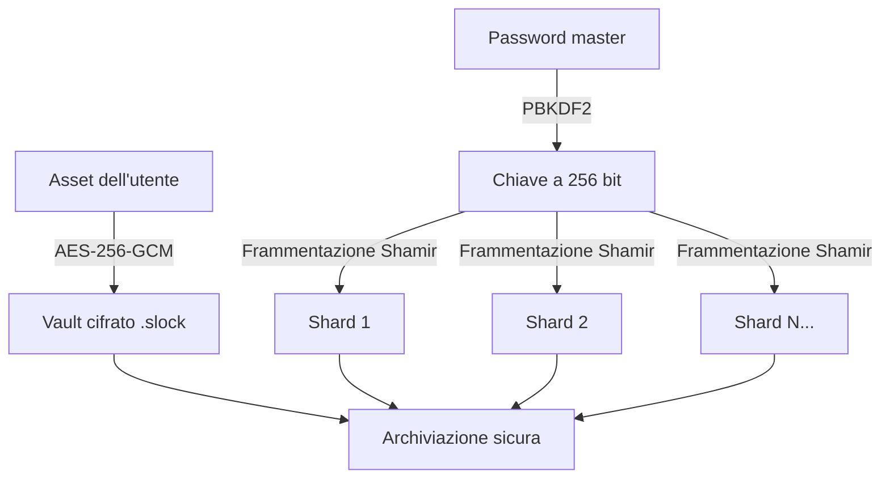

**Leggi in:** [🇺🇸 English](README.md) | [🇮🇹 Italiano](README_IT.md)

---
# 🛡️ ShardLock v1.0
### *Caveau File Avanzato con AES-GCM e Shamir's Secret Sharing*

**ShardLock** è uno strumento CLI ad alta sicurezza, multipiattaforma, progettato per eliminare i singoli punti di fallimento nell’archiviazione dei dati. Combina la **cifratura autenticata AES-256-GCM** con lo **Shamir's Secret Sharing (SSS)** per frammentare la chiave di decifratura in più **frammenti matematici** (*shard*).

---

## 📊 Architettura del Sistema

Il diagramma seguente illustra il flusso crittografico dal file originale ai frammenti distribuiti:



---

## 🚀 Funzionalità principali

- **Cifratura autenticata (AEAD):** usa **AES-256-GCM** per garantire sia la riservatezza sia l’integrità dei dati.
- **Crittografia a soglia:** i dati possono essere recuperati solo quando viene raggiunta una soglia minima (`k`) di shard.
- **Sicurezza information-theoretic:** senza il numero richiesto di shard, la ricostruzione della chiave è matematicamente impossibile.
- **Rafforzamento della password master:** implementa **PBKDF2** con **600.000 iterazioni** per derivare una chiave sicura a **256 bit** dall’input dell’utente.
- **Archiviazione zero-knowledge:** la chiave completa di decifratura non viene mai salvata su disco; esiste solo come insieme di punti matematici distribuiti.

---

## 🛠️ Installazione e utilizzo

## 📦 Eseguibile Standalone (Windows)
Se non hai Python installato, puoi scaricare la versione pronta all'uso:
1. Vai nella sezione [Releases](https://github.com/isilderrr1/ShardLock/releases).
2. Scarica il file `ShardLock.exe`.
3. Lancialo direttamente dal terminale o con un doppio clic.

*Nota: Essendo un binario non firmato, Windows Defender o altri Antivirus potrebbero segnalarlo come potenzialmente pericoloso. È un comune "falso positivo" per le applicazioni create con PyInstaller. Puoi procedere tranquillamente con l'esecuzione.*

### Prerequisiti

- **Python 3.13+**
- **Poetry** (gestore delle dipendenze)

### Setup

```bash
# Clona il repository
git clone https://github.com/your-username/ShardLock.git
cd ShardLock

# Installa le dipendenze
poetry install
```

### Avvio di ShardLock

Per entrare nel Command Center interattivo:

```bash
poetry run shardlock
```

---

## 🧠 Approfondimento tecnico: la matematica

ShardLock collega la logica applicativa ad alto livello con primitive crittografiche di basso livello.

### 1. AES-256-GCM (Il Vault)

ShardLock utilizza **Galois/Counter Mode (GCM)**. A differenza di modalità più vecchie come **CBC**, GCM fornisce **AEAD** (*Authenticated Encryption with Associated Data*).

Ogni file include un **tag di autenticazione da 16 byte**. Se un attaccante modifica anche un solo bit del file cifrato `.slock`, il sistema rileva la violazione d’integrità e interrompe la decifratura.

### 2. Shamir's Secret Sharing in `GF(2^8)`

Per proteggere la chiave, essa viene nascosta come termine costante `a₀` di un polinomio casuale di grado `k-1`:

```math
f(x) = a_0 + a_1x + a_2x^2 + \dots + a_{k-1}x^{k-1}
```

Dove:

- `a₀`: la chiave segreta derivata dalla password
- `k`: la soglia minima di shard necessari

Ogni shard è una coordinata:

```math
(x, f(x))
```

### Perché i campi di Galois?

L’aritmetica standard introduce errori di precisione e valori superiori a **255** (1 byte).  
ShardLock implementa l’**aritmetica nei campi finiti** in `GF(2^8)`:

- **Addizione:** eseguita tramite **XOR bit a bit**
- **Moltiplicazione / Divisione:** calcolate tramite tabelle **log / antilog** per garantire che ogni risultato resti nell’intervallo `[0, 255]`
- **Ricostruzione:** usa l’**interpolazione di Lagrange** per risolvere il sistema di equazioni e recuperare l’intercetta segreta `a₀`

---

## 📁 Struttura del progetto

```text
shardlock/
├── main.py      # TUI interattiva e CLI Command Center
├── crypto.py    # Motore core (AES-GCM, PBKDF2, logica SSS)
├── utils.py     # Componenti UI, sequenze di avvio e pulizia dei percorsi
tests/           # Script di validazione matematica per le operazioni nei campi di Galois
```

---

## 🛡️ Audit di sicurezza

- **Key Stretching:** usa **PBKDF2-HMAC-SHA256** per una forte resistenza alla forza bruta
- **CSPRNG:** tutti i nonce, i salt e i coefficienti del polinomio vengono generati con `os.urandom()`
- **Gestione sicura dei percorsi multipiattaforma:** utilizza `pathlib` per operazioni affidabili su **Windows** e **Linux**

---

## 📌 Sintesi

ShardLock non è solo un’utilità di cifratura file: è un vero **vault a fiducia distribuita**.  
Combinando **AES-256-GCM**, **PBKDF2** e **Shamir's Secret Sharing**, elimina il tradizionale singolo punto di compromissione e introduce un modello matematicamente elegante per il recupero sicuro della chiave.

---
